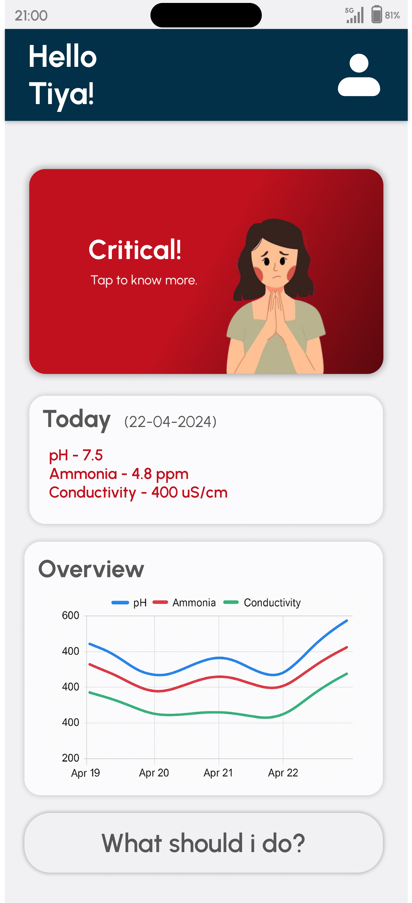

# Arm-Ailment Band – Backend & Frontend Python Integration

## Data Flow Summary

### 1. Frontend Request ([main.dart](../frontend/lib/main.dart))
User opens the app or taps refresh.

GET `/latest_prediction` → Fetches latest CKD probability.  
GET `/get_sensor_data` → Fetches latest pH, conductivity, and ammonia readings.

---

### 2. API Routing (FastAPI – [main.py](../frontend/main.py))
Endpoints in `main.py` receive HTTP requests and route them to the correct functions.

```python
@app.get("/latest_prediction")
def latest_prediction():
    pred = get_latest_prediction()
    return {"prediction": pred} if pred is not None else {"message": "No data yet"}
Handles /latest_prediction by calling get_latest_prediction() in database.py.
```
### 3. Prediction Logic (ML Model – model.py)
```python
predict_ckd() loads the CatBoost model and processes sensor data.

python
Copy
Edit
def predict_ckd(sensor_data: dict) -> float:
    mdl = load_model()
    X = np.array([[sensor_data['ph'],
                   sensor_data['conductivity'],
                   sensor_data['ammonia']]])
    prob = mdl.predict_proba(X)[0][1]
    return float(prob)
Takes pH, conductivity, and ammonia readings and returns CKD probability.
```

### 4. Data Storage & Retrieval (SQLite – database.py)
```python
Stores sensor readings and retrieves the latest prediction.

python
Copy
Edit
def get_latest_prediction():
    conn = sqlite3.connect(DB_FILE)
    cur = conn.cursor()
    cur.execute("SELECT prediction FROM sensor_data ORDER BY timestamp DESC LIMIT 1")
    row = cur.fetchone()
    conn.close()
    return row[0] if row else None
Returns the most recent stored prediction for use in /latest_prediction.
```
### 5. Configuration (config.py)
```python
Defines whether backend runs in dummy mode or esp32 mode.

python
Copy
Edit
# Select mode: "dummy" for simulated data or "esp32" for real device
MODE = "esp32"
```

## App UI Focus


<div align="center">

### Home Screen


### Detailed Report View


### Flagged Events


</div>

