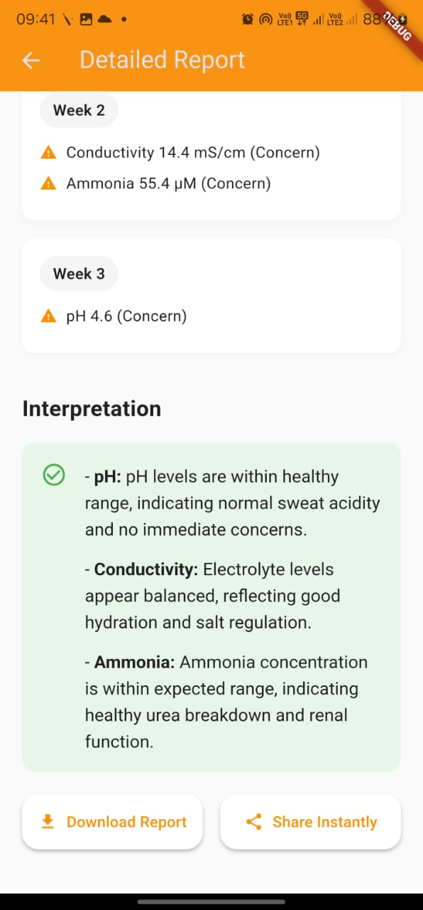
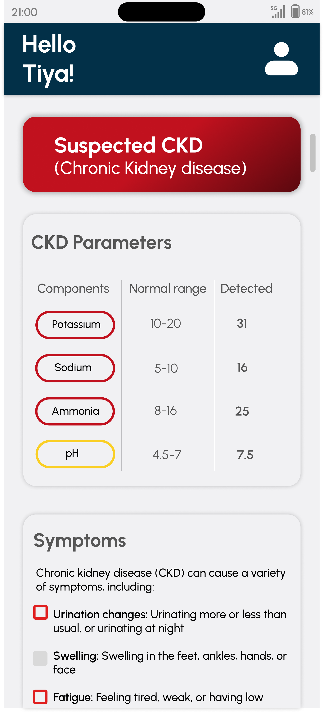

# Arm‑Ailment Band – Data‑Driven Disease Risk Monitoring

## Overview
The **Arm‑Ailment Band** is a non‑invasive wearable device that analyzes sweat biomarkers (pH, conductivity, ammonia) to detect early signs of chronic diseases such as CKD, dehydration, and metabolic disorders.  
While the hardware enables data collection, the **core strength** of this project lies in its **end‑to‑end data pipeline**, **machine learning models**, and **real‑time API integration** that power predictive health analytics.

---

## Problem Statement
**Problem:**  
Current diagnostic methods for chronic diseases are invasive, expensive, and time‑consuming, leading to delays in detection and treatment.

**Solution:**  
A sweat‑based wearable that continuously collects biomarker data, processes it via trained AI/ML models, and delivers real‑time risk predictions to a mobile app for early intervention.

---

## System Flow


**Workflow:**
1. **Data Acquisition** – pH, conductivity, and ammonia readings from ESP32 sensors (or Dummy Mode for testing).
2. **Backend Processing** – FastAPI service receives data, stores it in SQLite, and runs prediction via CatBoost/XGBoost.
3. **Prediction Engine** – Trained ML model outputs CKD probability (0–1).
4. **Data Access** – `/latest_prediction` endpoint provides real‑time results to the Flutter app dashboard.

---

## Technologies Used

**Machine Learning & Data Handling**
- Dataset: [UCI CKD Dataset](https://archive.ics.uci.edu/dataset/336/chronic+kidney+disease)  
- Preprocessing: KNN imputation, mode imputation, Min‑Max normalization, label encoding  
- Models: CatBoost, XGBoost, LightGBM, Neural Networks  
- Hyperparameter Tuning: Optuna  
- Metric: F‑Beta Score (>1 to penalize false negatives)

**Backend**
- FastAPI for API services  
- SQLite for lightweight data storage  
- CatBoost model integration for predictions  

**Frontend**
- Flutter mobile app for visualization and alerts  

**Hardware (supporting context)**
- ESP32 MCU for sensor control & wireless data transmission  
- Sweat biosensors (pH, conductivity, ammonia)  
- Self‑powered design with catalytic oxidation and supercapacitor storage  

---


## Repository Structure
```
arm-ailment-band/
│
├── backend/                  # FastAPI app, database, API flow diagram
│   ├── main.py
│   ├── model.py
│   ├── database.py
│   ├── config.py
│   ├── requirements.txt
│   └── api_flow.png
│
├── ml/                       # Data preprocessing, model training scripts
│   ├── preprocess.py
│   ├── train_catboost.py
│   ├── train_xgboost.py
│   └── evaluation.ipynb
│
├── frontend/                 # Flutter mobile application code
│
└── README.md                 # Project documentation
```


---

## Setup Instructions

**Backend**
```bash
cd backend
pip install -r requirements.txt
uvicorn main:app --reload


## Machine Learning

cd ml
python train_catboost.py
python train_xgboost.py

## Frontend

Open /frontend in Android Studio or VS Code with Flutter installed.

Configure API endpoint in app settings.


## API Endpoints
POST /send_sensor_data – Accepts pH, conductivity, and ammonia JSON data; returns CKD risk prediction.

GET /latest_prediction – Retrieves the latest stored prediction.

GET /get_sensor_data – Returns simulated or real sensor readings depending on mode.
```

## System & Feature Overview

<div align="center">

### Biomarker Interpretation


### Detailed CKD Description


### CKD Symptoms & Parameters


</div>


## Future Improvements

Expand biomarker panel for multi‑disease prediction.

Deploy backend and ML models to cloud (AWS/GCP) for scalability.

Implement advanced time‑series analytics for trend monitoring.
